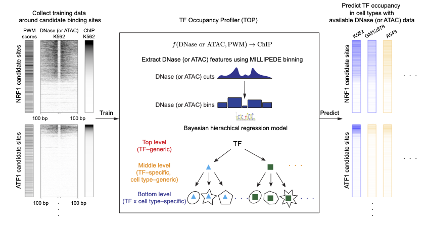

<!-- README.md is generated from README.Rmd. Please edit that file -->

```{r, include = FALSE}
knitr::opts_chunk$set(
  collapse = TRUE,
  comment = "#>",
  fig.path = "man/figures/README-",
  out.width = "100%"
)
```

Transcription factor Occupancy Profiler (TOP)
=================================================

<!-- badges: start -->
<!-- badges: end -->

Transcription factor Occupancy Profiler (TOP) fits a Bayesian hierarchical model 
using transcription factor (TF) motifs, DNase- or ATAC-seq data,
as well as ChIP-seq data (only required in training) 
from multiple TFs across multiple cell types. 

It can be used to predict the quantitative occupancy or binding probability
for many TFs using data from a single DNase- or ATAC-seq experiment. 
Thus, it allows efficient profiling of quantitative TF occupancy landscapes 
across multiple cell types or conditions using DNase- or ATAC-seq experiments.


```{r TOP-diagram, echo=FALSE, out.width = '90%'}

```

[TOP R package website](https://kevinlkx.github.io/TOP/) 
--------------------------------------------------------

### Install R package

You can install the development version of `TOP`
from [GitHub](https://github.com/kevinlkx/TOP) with:

``` r
# install.packages("devtools")
devtools::install_github("kevinlkx/TOP")
```

After installing, check that it loads properly:
``` r
library(TOP)
```

Dependencies:

In order to prepare input data using `TOP`, 
you will need to have the following R packages installed: 
[GenomicRanges][GenomicRanges], [Rsamtools][Rsamtools], 
[data.table][data.table], [ggplot2][ggplot2],
as well as the following command line tools: 
[bedtools][bedtools], [bwtool][bwtool], and [fimo][fimo] from [the MEME suite][MEME] 
as well as
[bedGraphToBigWig][bedGraphToBigWig] and [bigWigAverageOverBed][bigWigAverageOverBed]
from [UCSC binary utilities directory][UCSC utilities].

Optional: you will need to have R packages [R2jags][R2jags] and [doParallel][doParallel]
installed if you want to train your own models, as 
we use [JAGS][JAGS] to run Gibbs sampling for the Bayesian hierarchical model 
in the current implementation of the model. 


### Usage

Please follow the [tutorials][tutorials] to learn how to use the package. 

## Citing this work
-------------------

* Luo, K., Zhong, J., Safi, A., Hong, L., Tewari, A., Song, L., Reddy, T., Ma, L., 
Crawford, G., & Hartemink, A. (2020) "Quantitative occupancy of myriad 
transcription factors from one DNase experiment enables 
efficient comparisons across conditions." *bioRxiv*, bioRxiv:2020.06.28.171587.

## License

All source code and software in this repository are made available
under the terms of the [MIT license][mit-license].

[mit-license]: https://opensource.org/licenses/mit-license.html
[tutorials]: https://kevinlkx.github.io/TOP/articles/index.html
[paper_github]: https://kevinlkx.github.io/TOP/articles/index.html
[bedtools]: https://bedtools.readthedocs.io/en/latest/
[bwtool]: https://github.com/CRG-Barcelona/bwtool/wiki
[GenomicRanges]: https://bioconductor.org/packages/release/bioc/html/GenomicRanges.html
[Rsamtools]: https://bioconductor.org/packages/release/bioc/html/Rsamtools.html
[data.table]: https://cran.r-project.org/web/packages/data.table/index.html
[doParallel]: https://cran.r-project.org/web/packages/doParallel/index.html
[ggplot2]: https://ggplot2.tidyverse.org
[fimo]: https://meme-suite.org/meme/doc/fimo.html
[bedGraphToBigWig]:https://genome.ucsc.edu/goldenpath/help/bigWig.html
[bigWigAverageOverBed]:https://genome.ucsc.edu/goldenpath/help/bigWig.html
[UCSC utilities]: http://hgdownload.soe.ucsc.edu/admin/exe/
[R2jags]: https://cran.r-project.org/web/packages/R2jags/index.html
[JAGS]: https://mcmc-jags.sourceforge.io
[MEME]:https://meme-suite.org/meme/index.html

