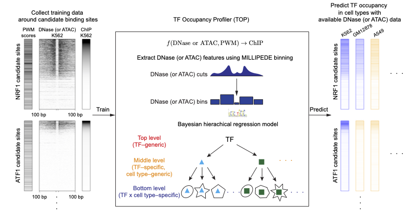

<!-- README.md is generated from README.Rmd. Please edit that file -->

# Transcription factor Occupancy Profiler (TOP)

<!-- badges: start -->
<!-- badges: end -->

Transcription factor Occupancy Profiler (TOP) fits a Bayesian
hierarchical model using transcription factor (TF) motifs, DNase- or
ATAC-seq data, as well as ChIP-seq data (only required in training) from
multiple TFs across multiple cell types.

It can be used to predict the quantitative occupancy or binding
probability for many TFs using data from a single DNase- or ATAC-seq
experiment. Thus, it allows efficient profiling of quantitative TF
occupancy landscapes across multiple cell types or conditions using
DNase- or ATAC-seq experiments.



## [TOP R package website](https://kevinlkx.github.io/TOP)

### Install R package

You can install the development version of `TOP` from
[GitHub](https://github.com/kevinlkx/TOP) with:

``` r
# install.packages("devtools")
devtools::install_github("kevinlkx/TOP")
```

After installing, check that it loads properly:

``` r
library(TOP)
```

### Usage

Please follow the
[tutorials](https://kevinlkx.github.io/TOP/articles/index.html) to learn
how to use the package.

## ## Citing this work

-   Luo, K., Zhong, J., Safi, A., Hong, L., Tewari, A., Song, L., Reddy,
    T., Ma, L., Crawford, G., & Hartemink, A. (2020) “Quantitative
    occupancy of myriad transcription factors from one DNase experiment
    enables efficient comparisons across conditions.” *bioRxiv*,
    bioRxiv:2020.06.28.171587.

## License

All source code and software in this repository are made available under
the terms of the [MIT
license](https://opensource.org/licenses/mit-license.html).
